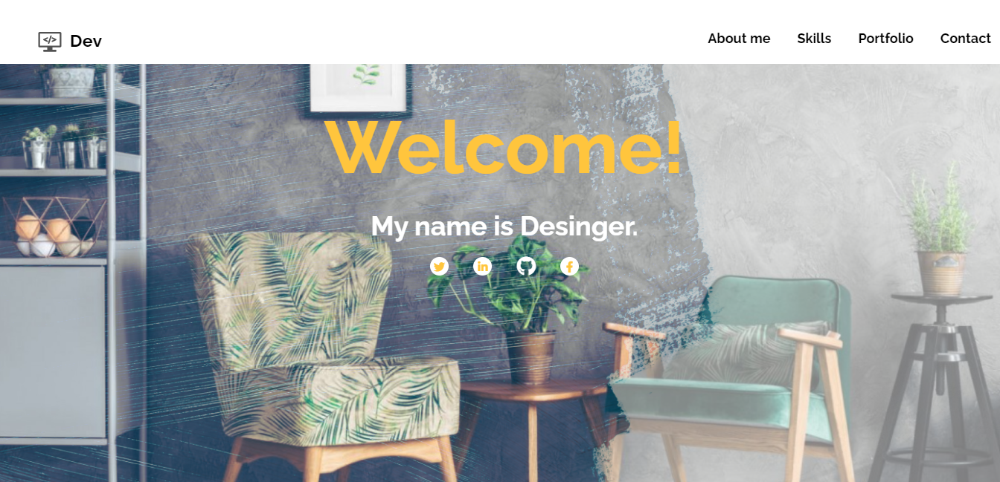
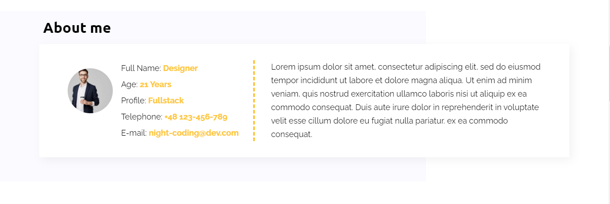
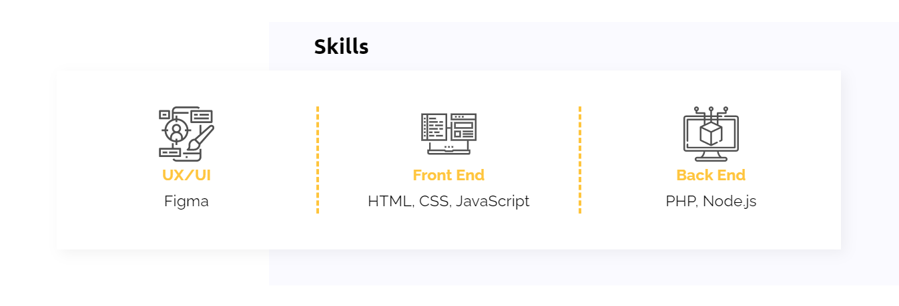
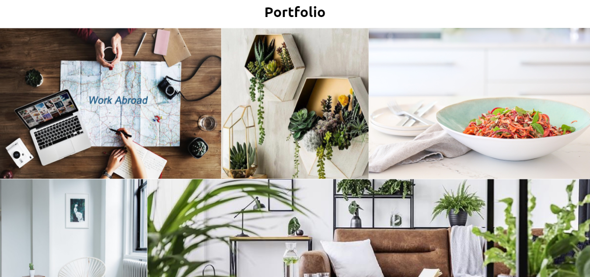
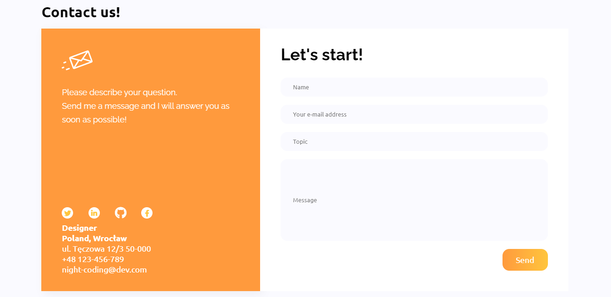

# CodersCamp 2020 - Projekt HTML & CSS

## Szablon portfolio
Projekt realizowany w ramach kursu programowania webowego Coders Camp. Tematem projektu jest strona internetowa mogąca służyć za portfolio programisty. Posłużono się gotowym interfejsu strony dostępnym [tutaj](https://www.figma.com/file/WHtiMfcNHt4tc7mDamNBYa/CodersCamp2020-Wizytowka?node-id=0%3A1). 

Zobacz [demo](https://marlexxa.github.io/portfolio-example/) projektu.

### Wykorzystane technologie
W projekcie wykorzystano wyłącznie technologie HTML oraz CSS. Wykorzystano takie zaganienia jak box-model, flexbox, grid, position (absolute, relative), keyframes. Arkusz styli tworzono wykazując się znajomością selektorów CSS oraz kaskadowością. Zostały użyte zewnętrzne czcionki google fonts oraz ikony fontawesome.

### Responsywność
Stworzona strona jest w pełni responsywna. Interfesjs strony dla szerokości ekranu powyżej 1024px możesz zobaczyć [tutaj](https://raw.githubusercontent.com/marlexxa/portfolio-example/main/.github/images/big-device.png), dla szerokości poniżej 1024px i powyżej 650px [tutaj](https://raw.githubusercontent.com/marlexxa/portfolio-example/main/.github/images/middle-device.png), a dla szerokości ekranu poniżej 650px [tutaj](https://raw.githubusercontent.com/marlexxa/portfolio-example/main/.github/images/small-device.png). Dodatkowo dla szerokości ekranu poniżej 650px w sekcji porfolio nie pojawiają się szczegółowe opisy projektów, jedynie przycisk odsyłający do repozytorium.

### Budowa strony
Główną sekcją strony jest strona powitalna, na której programista wita się z odbiorcą. Na górze tej karty znajduje się nawigacja, która odsyła użytkownika do pozostałych sekcji.

Kolejna sekcja jest bardzo miła i umożliwa szybki kontakt z właścicielem strony lub sprawdzenie jego CV (aktualnie odsyła do strony głównej LinkedIn).

Sekcja "About me" przedstawia właściciela strony. 

Zakładnka "Skills" prezentuje umiejętności jakimi w swoich projektach wykazuje się potencjalny programista. 

Następnie użytkownik strony ma podgląd na szybki podgląd wykonanych przez programistę projektów wraz z krótkim opisem po najechaniu na konkretny projekt. Przycisk "View" miałby docelowo służyć jako odnośnik do repozytorium danego projektu.

Ostatnim elementem strony jest sekcja kontaktu z programistą. Znajdują się tam podstawowe dane kontaktowe wraz z mediami społecznościowymi oraz gotowy formularz kontaktowy.

## Commit Message Type
- build: dodanie nowych plików do projektu 
- feat: dodanie nowej funkcjonalności dla użytkownika
- fix: naprawienie błędu
- refactor: refaktoryzacja kodu, nic nie dodaje ani nie naprawia (np.zmiana nazwy zmiennej)
- style: formatowanie kodu (np. wcięcia, dodanie średników)
- docs: zmiany w dokumentacji
